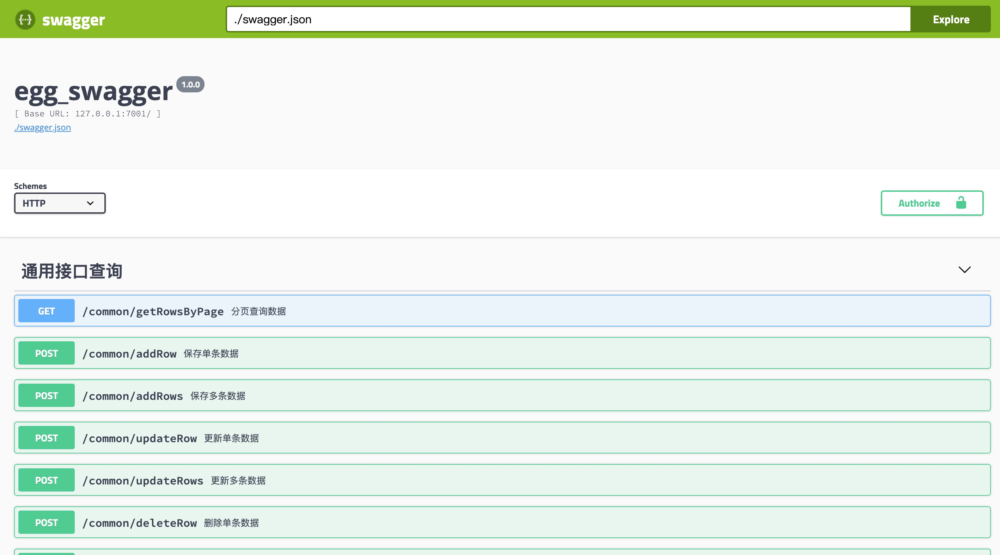

# egg


## QuickStart

<!-- add docs here for user -->

see [egg docs][egg] for more detail.

### Development

```bash
$ npm i
$ npm run dev
$ open [egg_swagger](http://127.0.0.1:7001/api/swagger/index.html)
```


